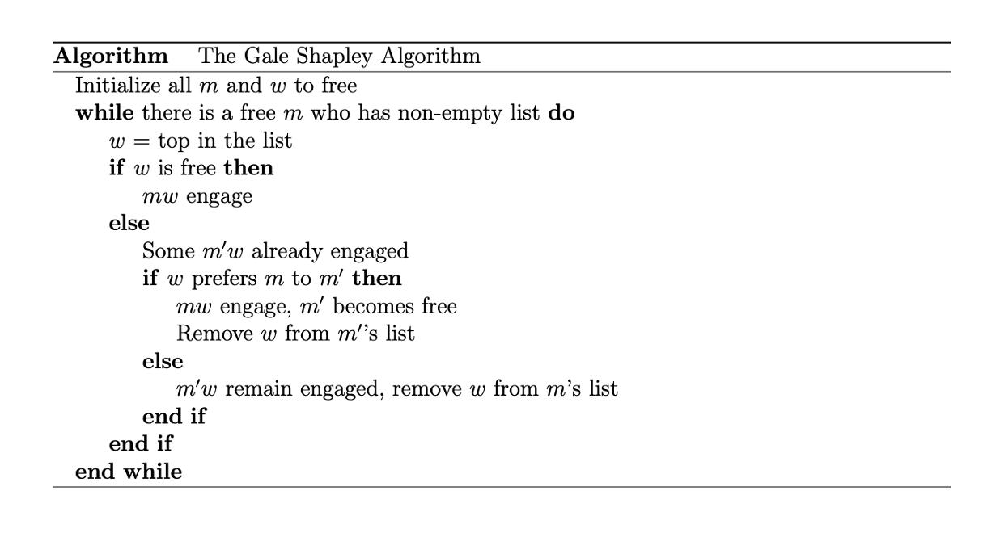

# GALE-SHAPLEY ALGORITHM (Stable Matching Problem)

## Introduction
Gale Shapley Algorithm

Gale Shapley (GS) Algorithm also known as the Stable Matching (SM) problem is a constructive algorithm used to find a stable match meaning for given a candidate the algorithm would find its preferable partner. It is an efficient graph algorithm that is used for solving "Stable Matching" problem. It has a time complexity of O(N^2), where N is the number of entries (i.e. the number of people involved).

The classic stable marriage (SM) problem can be stated as below: Given n men and n women, where each person has ranked all members of the opposite sex with a unique number between 1 and n in order of preference, marry the men and women together such that there are no two people of opposite sex who would both rather have each other than their current partners. If there are no such people, all the marriages are “stable”. Gale and Shapley gave their famous deferred acceptance algorithm in 1962 which always finds a stable matching.

When the preference lists are incomplete and/or have ties, the problem becomes more challenge (called Stable Marriage with Incomplete List and Ties, SMTI). For SMTI, the GS algorithm still finds a stable matching. However, in this case, we are usually interested in finding a stable matching with maximum size. While the matching size of the GS algorithm is at least half of the optimal matching size, a modified version of the GS algorithm was proposed to guarantee 2/3 of the optimal matching size. Algorithms for finding solutions to the stable marriage problem have applications in a variety of real-world situations. A well known example is in the assignment of graduating medical students to their first hospital appointments. In 2012, the Nobel Prize in Economics was awarded to Lloyd S. Shapley and Alvin E. Roth for the theory of stable allocations and the practice of market design.

## Problem Statment 

Stable Matching problem arises as a problem for selecting the suitable and most perfect partner for marriage. The problem requires at any given condition the pairing between a couple should be so, that only the most suitable people are paired as a couple. The algorithm requires 2 sets of input(group of people: male and female),

The first set contains females
The second set contains males.
Each person in each set has a list of preferences which includes all the people from the opposite set. That is, every woman in the set has a preference list that contains all the men in the other set. Similarly, every man has a preference list that contains all the women in the other set.

We assume that females can be matched to only males and vice versa.
Also, there is no male who also identifies as female and no female identifies as male.
A person can be of the same preference to many people in the opposite set i.e. A woman named 'A' may be the first preference of 2 men '1' and '2'.
The preferences are not reciprocated i.e If 'A' is the first preference of '1', but '1' need not be 'A's' first preference.
Under these conditions, we need to perform a matching so that every person is engaged to his/her most preferable choice.

Before going on to solving this problem, we need to choose the proposers' side i.e the people who will be proposing to the other set. The result obtained might vary slightly on this choice, but both the results will be stable matchings even if they are not the same.

## Algorithm

## Example
The GS Problem can be defined by considering the below example. Consider the image below where there are 5 boys (1,2,3,4,5) who would be the input candidates and there are 5 girls (A,B,C,D,E) who are the preferable candidates or vice versa. These boys and girls have their own preference for a partner. That is each boy has a list of girls whom he wants to partner/dance/play with, ranking them from most desirable to least desirable, and on the other hand each girl has a list of boys whom she wants to partner/dance/play with, ranking them from most desirable to least desirable. A girl is acceptable for a boy if she is on his preference list; similarly, a boy is acceptable for a girl if he is on her preference list. Everyone's preferences depend only on their own opinions; there is no jealousy (in economic terms, there are no externalities). No one is forced to dance with anyone who is not on their preference list.

<b>A matching:</b> An outcome which tells everyone in the room who their dance partners are. Formally, a matching is a function that maps the set of boys and girls onto itself.

<b>Stability: </b>Suppose a matching has been made but there is a boy and a girl who want to dance with each other rather than dance with the person the matching matched them up with. Then they are said to form a blocking pair. A stable matching happens if there are no blocking pairs.

## Algorithm Walkthrough
Step 1. Each boy proposes to his first acceptable choice (if he has any names on his preference list). Each girl who receives an offer rejects all offers except the best acceptable proposal (according to her preference list), which she holds on to.

Step k. Any boy who was rejected at step k − 1 makes a new proposal to his most preferred girl on his list who has not yet rejected him. (If he ran through the names on his list, he makes no more proposals.) Each girl holds her most preferred acceptable proposal to date, and rejects the rest.

Algorithm terminates when there are no more rejections and each girl is matched with the boy she has been holding in the last step. Any girl who has not been holding an offer or any boy who was rejected by all acceptable girls remains single.

Note: In the explanation above, we had boys propose for demonstration purposes, but of course, girls can propose too, and in that case, we would reach a stable matching as well.

## Observation
Random paths to stability Gale-Shapley algorithm implies a centralized authority who can match men and women by collecting their preference lists and using them to output a stable matching.

Question: Can a group of men and women reach a stable outcome if they match up in a decentralized way? In other words, if men and women date each other, break up, date another, break up, etc. out on their own, can they reach a stable matching eventually?

Roth and van de Vate (1990) answered this question in the affirmative. They proved that starting from any unstable matching, there exists a path to a stable matching. This result suggests that stable matchings are a natural converging point for two-sided matching problems. Note that we are not sure which stable matching will be reached in this decentralized setting, whereas in the Gale-Shapley algorithm, we are very certain which stable matching will be reached.

## Conclusion
- It finds the best outcome for the people on the proposing side and the worst outcome for the people on the receiving side.
- It is strategy-proof for the proposers, i.e. no proposer benefits by unilaterally submitting a false preference list.
- It is always in the best interest of the proposer to submit their true preference list.

## References
1. SNAP- Stanford Network Analysis Project [link](https://snap.stanford.edu/papers.html)
3. John P Dickerson(CMU) - Stable Matching [link](http://www.cs.cmu.edu/~arielpro/15896s16/slides/896s16-16.pdf)
4. Yilong Geng & Mingyu Gao(Stanford)- Stable Marriage using Spark [link](https://stanford.edu/~rezab/classes/cme323/S15/projects/stable_marriage_spark_report.pdf)
5. Jon Kleinberg(Princeton University)- Stable Matching Algorithm lecture slides [link](https://www.cs.princeton.edu/~wayne/kleinberg-tardos/pdf/01StableMatching.pdf)
2. Asynchronous Self-Stabilizing Stable Marriage (Current Research in the GS Algo) [link](https://tel.archives-ouvertes.fr/tel-03068501/document)

## Disclaimer
Above links were only referenced for reference and for the purpose of understanding the algorithm, any similarity in code is purely coincidential
